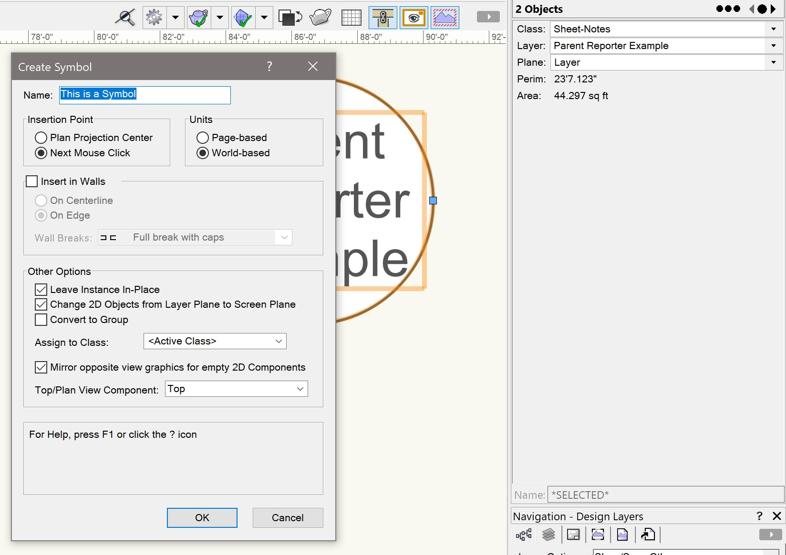

# Parent Reporter

Plug-in Object

## Icon

## Version

1.0.1 - 2/2/2025

This plug-in is written in Vectorscript (Pascal) and can be used in any version of [Vectorworks](https://www.vectorworks.net) 2019 or newer.

## Description

Creates a **Text** object reporting the name of the parent container (Layer, Symbol, Viewport).

## Instructions

1. Set the initial font, text style, and text size settings using the **Text** menu.
2. Activate the **Parent Reporter** tool.
3. Place the **Parent Reporter** object in the desired location. The center of the Text box is the origin point of the object. The text in the object will list out the name of the parent of the object.
    - When placed on a **Design** or **Sheet Layer**, the object will report the name of the **Layer**.
    - When placed inside of a **Symbol**, the object will report the name of the **Symbol Definition**.
    - When placed inside of a **Viewport Annotation**, the object will report the name of the **Viewport**.
    - When placed inside of a **Group**, the object will report *None* unless the **Group** is named, in which case it will report the name of the **Group**.
4. Choose whether to **Wrap Text** and set a **Text Width**.
    - The **Text Width** will default to 12' in imperial units and 10m in metric.

## Object Info Palette Parameters

1. **Parent**: Name of the selected **Parent Reporter** object's parent.
2. **Wrap Text**: Check this box to force the parent name text to "wrap" lines based on the **Text Width** parameter.
3. **Text Width**: This value will determine the width of the parent name text when the **Wrap Text** box is checked.

## Use Inside Symbols

Placing a **Parent Reporter** object inside of a **Symbol** will cause the object to report the name of the **Symbol Definition**. When doing this through editing a **Symbol Definition** directly, this should be instant.  When creating a **Symbol** using the **Create Symbol** command with a **Parent Reporter** object selected, the object will initially report *None* until the object is manually reset by editing the **Symbol Definition** or by using the **Refresh Parent Reporters** menu command.

|  |
| :--: |
| *Selecting objects on Design Layer* |

|  |
| :--: |
| *Creating Symbol using ***Create Symbol*** command* |

|  |
| :--: |
| *Resulting Object* |

|  |
| :--: |
| *Object after running ***Refresh Parent Reporters*** command* |

## Supplemental Menu Commands

### Refresh Parent Reporters:

- Forces all **Parent Reporter** objects in drawing to reset and update the parent name text.
- For **Parent Reporter** objects found inside **Symbol Definitions**, the thumbnail in the **Resource Manager** will be updated and all instances of the symbol within the drawing will be reset.
- Will report how many **Parent Reporter** objects were refreshed in an Alert Dialog.

## Tips and Tricks

- The font, font style, and size of the parent name text can be changed by selecting the **Parent Reporter** object and using the **Text** menu.
- The color of the parent name text is determined by the Pen Color settings in the **Attributes** palette, and the Fill Style and Fill Color determine the color and style of the space behind the text.

## Installation Instructions

There are two methods of installation, direct download of the plug-in or through the **JNC Tools Free Manager** plug-in.

### Direct Download:

1. Download [source plug-in file](Parent%20Reporter.vso) and [menu command file](Refresh%20Parent%20Reporters.vsm)
2. Place downloaded files inside the **Vectorworks User Folder** within the **Plug-ins** directory
3. Restart Vectorworks

### JNC Tools Free Manager

1. Run the [**JNC Tools Free Manager**](https://jncogs.github.io/JNC-Tools-Manager-Free/) menu command
2. Select the **Parent Reporter** tool
3. Press the **Install / Update** button
4. Select the **Refresh Parent Reporters** menu command
5. Press the **Install / Update** button
6. Press **Close** to close the dialog box
7. Restart Vectorworks

## Adding the Plug-in to your Workspace

1. Open the **Workspace Editor** by going to **Tools - Workspaces - Edit Current Workspace**
2. Select the **Tools** tab
3. In the box on the left, find and expand the **JNC** category
4. In the box on the right, find a suitable tool set to place the tool in, such as **Basic** or **Dims / Notes**
5. Click and drag the **Parent Reporter** tool from the box on the left to the desired tool set in the box on the right
6. Select the **Menus** tab
7. In the box on the left, find and expand the **JNC** category
8. In the box on the right, find a suitable menu to place the command in, such as **Tools**
9. Click and drag the **Refresh Parent Reporters** command from the box on the left to the desired menu location in the box on the right
10. Click **OK** to close the editor

## Localization Instructions

The plug-in can be localized to your native language without having access to the source code.  This can be achieved by following the instructions below:

1. Open the **Plug-in Manager** by going to **Tools - Plug-ins - Plug-in Manager**
2. Select the **Third-party Plug-ins** tab
3. Select the **Parent Reporter** tool
4. Click the **Customize** button
5. Select the **Strings** tab
6. Double-click a category, such as **Dialog Strings**
7. Select a string to edit and press the **Edit** button
8. Write a new string and press the **OK** button until you are back to the **Plug-in Manager**

The categories for this plug-in are as follows:

- **3000** - *Misc Strings*: This category contains a single string, used when the plug-in object cannot identify the name of its parent or if its parent is not a named object, such as a **Group**. This is *None* by default.

The **Refresh Parent Reporters** menu command uses the following plug-in strings:

- **3000** - *Record Strings*: This category contains the name of the **Parent Reporter** record. If the **Parent Reporter** has been localized and the name of the object has been changed, update this string to match.
- **4000** - *Misc Strings*: This category contains a single string, used for the Alert Dialog box reporting the number of objects refreshed.

## Release Notes

| Date | Version | Note |
| :---: | :---: | :--- |
| 01/10/2025 | 1.0.0 | Initial release |
| 02/02/2025 | 1.0.1 | Added Refresh Parent Reporters menu command    Text will now use Fill Style and Fill Color of plug-in object |

## Known Bugs

No Known Bugs

## Feature Requests

No current Feature Requests

## License

Copyright (c) Jesse Cogswell (JNC Tools)

Permission is hereby granted, free of charge, to any person or organization
obtaining a copy of this software (the "User") and associated documentation files (the "Software"),
to use, reproduce, distribute, execute, and transmit the Software.

The User is not permitted to modify or attempt to reverse engineer the source code.  The User may
localize the Software using approved methods from within the Vectorworks software.

THE SOFTWARE IS PROVIDED "AS IS", WITHOUT WARRANTY OF ANY KIND, EXPRESS OR
IMPLIED, INCLUDING BUT NOT LIMITED TO THE WARRANTIES OF MERCHANTABILITY,
FITNESS FOR A PARTICULAR PURPOSE, TITLE AND NON-INFRINGEMENT. IN NO EVENT
SHALL THE COPYRIGHT HOLDERS OR ANYONE DISTRIBUTING THE SOFTWARE BE LIABLE
FOR ANY DAMAGES OR OTHER LIABILITY, WHETHER IN CONTRACT, TORT OR OTHERWISE,
ARISING FROM, OUT OF OR IN CONNECTION WITH THE SOFTWARE OR THE USE OR OTHER
DEALINGS IN THE SOFTWARE.